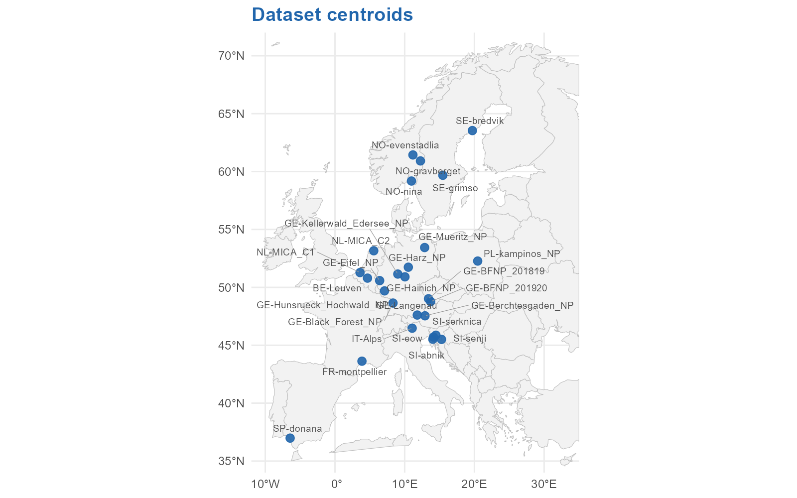
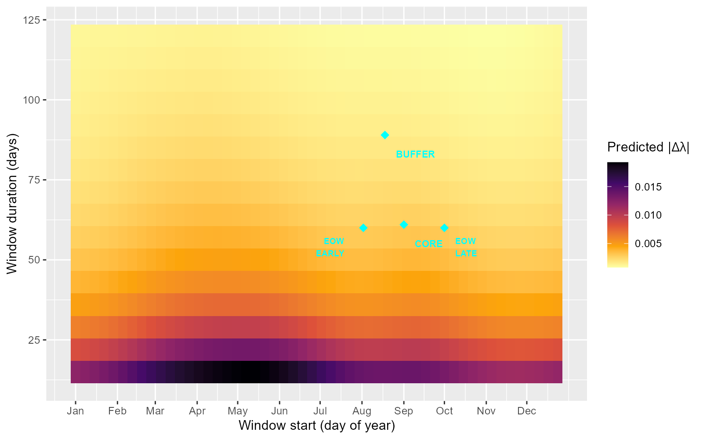
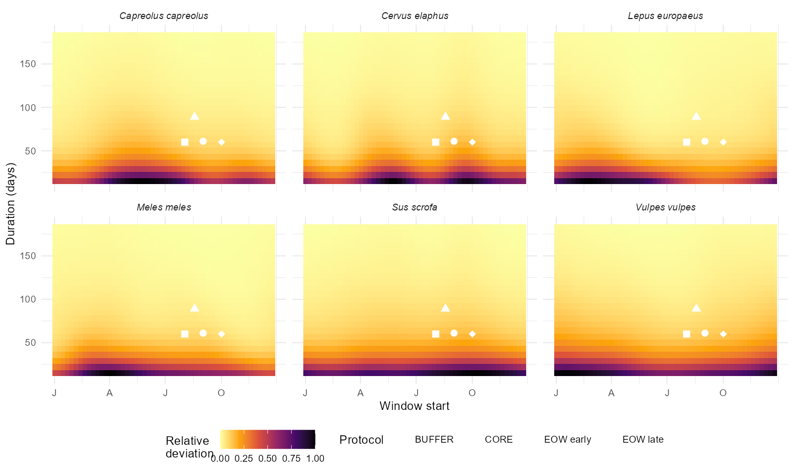
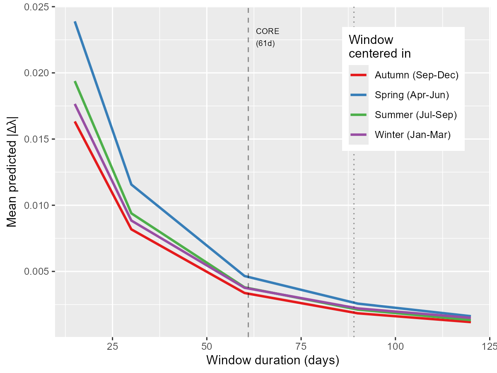
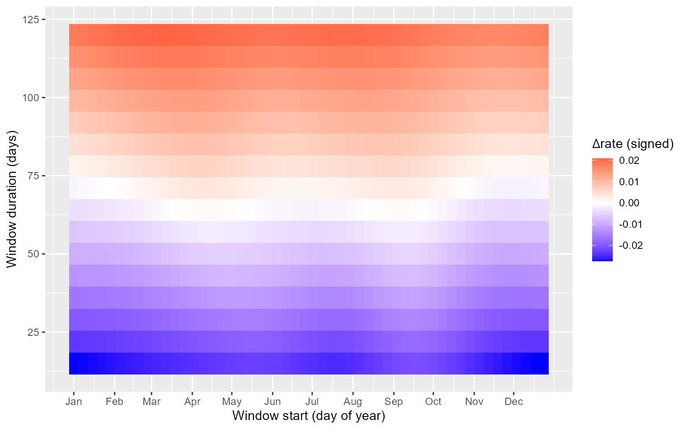
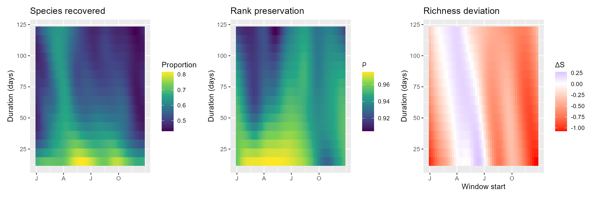
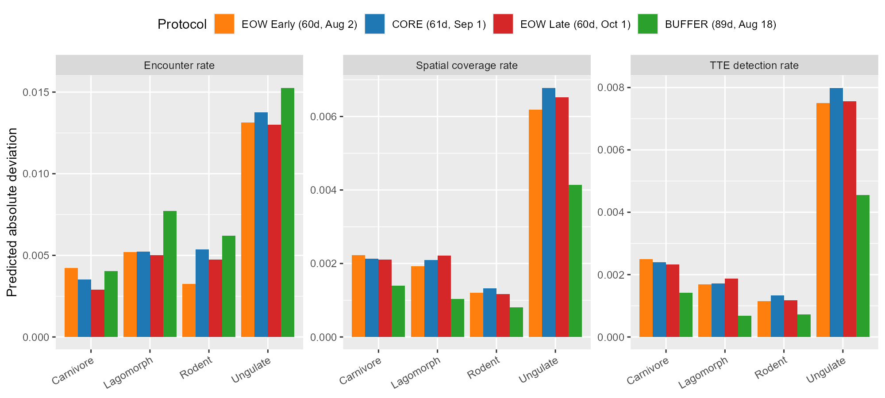
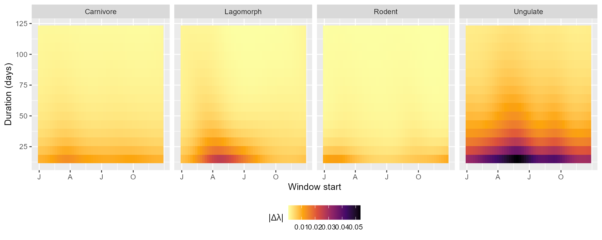
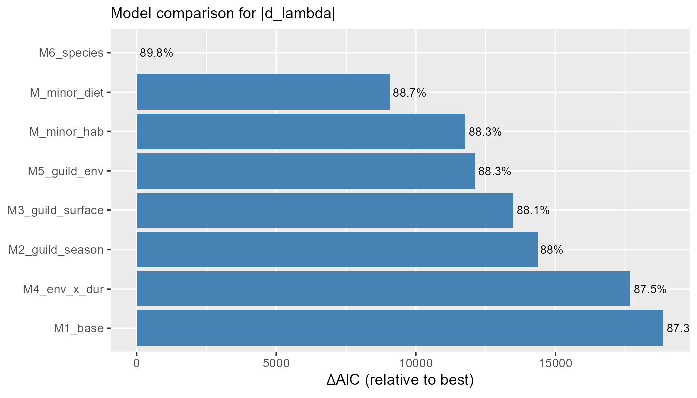

# Sensitivity of Camera-Trap Sampling Window Design on Detection Metrics

How does the choice of temporal sampling window affect what camera traps tell us about wildlife? This project builds a **sensitivity surface** — a systematic map of how detection metric deviation from a 12-month benchmark varies as a function of window **timing** and **duration** — across 26 European camera-trap datasets (35 dataset-slices) and 29 mammal species. A benchmark noise floor analysis (inter-annual variability of the 12-month reference) provides a species-specific stopping rule for the diminishing-returns question: *how long is long enough?*



------------------------------------------------------------------------

## Research Questions

| # | Question | Approach |
|---|----------|----------|
| Q1 | How does deviation depend on window **duration**? | Marginal effect of `window_len` from the tensor surface |
| Q2 | How does deviation depend on window **timing** (season)? | Marginal effect of `day_start` from the tensor surface |
| Q3 | How do duration and timing **interact**? | Full 2D tensor surface; contrast short vs long windows across seasons |
| Q4 | How do **species traits** modulate the surface? | Species-specific surfaces (M6); aggregate by guild for interpretation |
| Q5 | How does **latitude** modulate the surface? | `s_latitude` coefficient |
| Q6 | Where do **named protocols** sit on the surface? | Predict at CORE (day 244, 61d), BUFFER (day 230, 89d), EOW_EARLY (day 214, 60d), EOW_LATE (day 274, 60d) |
| Q7 | What is the **optimal window** design? | Find timing that minimises predicted deviation at given durations |
| Q8 | How does **species richness** recovery vary across the surface? | Richness models (prop_sr_full, d_sr_raref, rho_lambda) |
| Q9 | At what duration does deviation fall **below benchmark noise**? | SNR = \|d_lambda\| / inter-annual SD(lambda_full); species-specific noise-floor thresholds |
| Q10 | Do the three absolute deviation metrics **agree**? | Pairwise correlations and side-by-side surfaces for \|d_lambda\|, \|d_rate\|, \|d_matched_rate\| |

------------------------------------------------------------------------

## Metrics & Response Variables

All response variables quantify how much a sub-window deviates from a full 12-month benchmark computed on the same dataset-slice. The benchmark is an **operational reference** ("what year-round monitoring would give"), not ecological truth.

### Species-level detection metrics

| Metric | Formula | Sign | What it measures |
|--------|---------|------|-----------------|
| `lambda` | `n_first_detections / total_exposure` | — | Daily detection rate from TTE (time-to-first-event per camera). Window-length independent. |
| `d_lambda` | `lambda_window − lambda_full` | ~99% positive | Deviation of TTE daily detection rate from the 12-month benchmark. **Primary response variable.** Positive bias arises mechanically because `lambda_full` is pulled toward the harmonic mean of seasonal rates (survival-time weighting), while sub-windows provide clean local estimates. |
| `rate` | `n_events / trap_days` | — | Encounter rate (events per trap-day). |
| `d_rate` | `rate_window − rate_full` | ~59% positive | Raw encounter rate deviation. Bidirectional: positive in high-activity seasons, negative in low-activity seasons. |
| `matched_rate` | `−log(1 − spatial_cov_m) / L` | — | Daily detection rate derived from spatial coverage on matched cameras (cameras active in both window and full year). Deconfounds denominator and accumulation effects. |
| `d_matched_rate` | `matched_rate_window − matched_rate_full` | ~95% positive | Fully deconfounded detection rate deviation. Closely tracks `d_lambda` (*r* = 0.97). |

**Why three metrics?** `d_lambda` and `d_matched_rate` are both TTE-based and highly correlated but computed from independent sources (event times vs spatial coverage); they serve as a cross-validation of each other. `d_rate` is event-count-based and bidirectional — useful for studying *direction* of bias, not only magnitude.

**Structural confounds avoided.** Three confounds present in earlier metric versions have been resolved:
- `p_tte` (detection probability) had a length-scaling confound → replaced by `lambda`.
- `spatial_cov` had denominator and accumulation confounds → replaced by `matched_rate`.
- `log_rate` amplified small differences at low baseline rates → replaced by `d_rate`.

### Community-level metrics

| Metric | Formula | What it measures |
|--------|---------|-----------------|
| `prop_sr_full` | \|spp_window ∩ spp_full\| / \|spp_full\| | Proportion of full-year species detected. Peaks for spring windows. |
| `d_sr_raref` | `sr_raref_window − sr_raref_full` | Rarefied richness deviation (standardised to common sampling intensity). |
| `rho_lambda` | Spearman ρ across species | Rank preservation of detection rates between window and full year. Uniformly high (≥0.91 at 64 d), filtered to windows with ≥5 shared species. |

### Absolute vs signed deviations

Models are fitted on **absolute deviations** (`abs_d_lambda`, etc.) to capture *magnitude* of error regardless of direction — the relevant quantity for monitoring design. The signed `d_rate` model is fitted separately to characterise *direction* of bias (over- vs underestimation by season).

------------------------------------------------------------------------

## Models

All models are GAMMs fitted via `mgcv::bam()` with cyclic splines for day-of-year circularity.

### Best species-level model (M6)

```r
abs_d_metric ~
  te(day_start, window_len, bs = c("cc", "tp"), k = c(8, 6), by = species_f) +
  species_f +
  l_trapdays + l_nsites + s_latitude + s_trap_array +
  s(ds_sp_f, bs = "re")
family = Gamma(link = "log")
knots = list(day_start = c(0, 365))
```

Species-specific 2D tensor product surfaces allow the timing × duration interaction to differ across species. Penalisation controls complexity: data-poor species receive near-flat surfaces automatically.

### Model comparison (|d_lambda|, 218,663 observations, 29 species)

| Model | Structure | Dev. explained |
|-------|-----------|----------------|
| M1 | Shared surface + covariates | 74.0% |
| M2 | + guild-varying seasonality | 77.4% |
| M3 | Full guild × surface | 83.5% |
| M_hab | Habitat guild surfaces (9 levels) | 84.5% |
| M_diet | Diet guild surfaces (10 levels) | 85.1% |
| **M6** | **Species-specific surfaces (29 species)** | **87.0%** |

### Performance across all metrics (M6 structure)

| Response | Family | Dev. explained | Interpretation |
|----------|--------|----------------|----------------|
| \|d_lambda\| | Gamma(log) | 87.0% | TTE daily detection rate deviation |
| \|d_matched_rate\| | Gamma(log) | 86.4% | Deconfounded spatial-coverage rate deviation |
| \|d_rate\| | Gamma(log) | 71.2% | Raw encounter rate deviation |
| d_rate (signed) | Gaussian | 19.0% | Direction of encounter rate bias |
| prop_sr_full | Beta(logit) | 77.3% | Proportion of full-year species recovered |
| d_sr_raref | Gaussian | 24.7% | Rarefied richness deviation |
| rho_lambda | Beta(logit) | 39.3% | Rank preservation of detection rates |

### Leave-one-dataset-out cross-validation

| Metric | In-sample R² (full) | In-sample R² (fixed only) | LOO-CV R² | LOO-CV *r* |
|--------|---------------------|---------------------------|-----------|------------|
| \|d_lambda\| | 0.688 | 0.424 | 0.306 | 0.553 |
| \|d_matched_rate\| | 0.489 | 0.341 | 0.259 | 0.509 |
| \|d_rate\| | 0.615 | 0.203 | 0.147 | 0.383 |

The surface *shape* (timing × duration patterns) generalises well to unseen sites; absolute deviation *magnitude* at new sites requires the dataset × species random effect. LOO-CV R² for lambda achieves 72% of the fixed-effects-only ceiling.

------------------------------------------------------------------------

## Key Results

### The sensitivity surface

A 2D heatmap of predicted absolute deviation in daily detection rate (|Δλ|), averaged across species. White diamonds mark the Snapshot Europe CORE and BUFFER windows, plus the ENETWILD EOW split.



**Short windows centred on autumn show the largest deviations**, driven by ungulate rutting-season activity spikes that inflate detection rates well above the annual average.

### Species-level variation

Species identity dominates the surface (ΔAIC ≈ −19,200 over guild-level models). Six focal species illustrate the range — each panel is colour-normalised to its own minimum and maximum so that species-specific seasonal patterns are visible. Protocol positions (CORE, BUFFER, EOW early/late) are marked.



*Cervus elaphus* and *Sus scrofa* show intense autumn hotspots (rut), while *Vulpes vulpes* and *Lepus europaeus* have near-flat surfaces — their detection is relatively stable year-round.

### Duration effect

Deviation drops steeply with window length, then plateaus. ~80% of the reduction occurs by 60 days. Short windows are most timing-sensitive. This pattern holds for |d_matched_rate| (68% reduction by 57d, 79% by 85d) but not for |d_rate|, whose predicted deviation is nearly flat across durations — consistent with its lower deviance explained (71% vs 87%) and weaker duration dependence (see [FigS3](figures/FigS3_metric_comparison.pdf)).



### Signed encounter rate deviation

Summer/autumn windows tend to **overestimate** encounter rates (red), while winter/spring windows **underestimate** them (blue). d_lambda and d_matched_rate are predominantly positive (~99% and ~95%) due to the TTE survival-time weighting mechanism — not a confound but a genuine statistical property.



### Community-level recovery

Species richness recovery favours spring-started windows and increases monotonically with duration. Rank preservation (Spearman ρ) is uniformly high (0.91–0.98) — even biased windows preserve species ordering.



### Protocol evaluation

CORE and BUFFER sit on the edge of the autumn deviation hotspot. BUFFER benefits primarily from its longer duration (89d vs 61d), not its timing. At 60 days, all three autumn protocols (CORE, EOW early, EOW late) show similar deviation.



### Guild-level surfaces

Ungulates dominate the autumn signal:



### Model comparison



### Benchmark noise floor

The 12-month benchmark itself fluctuates year-to-year (median inter-annual CV = 23% from 4 multi-year sites). Sub-window deviations are only informative when they exceed this inter-annual noise. We define SNR = |Δλ| / SD(λ_full).

| Window duration | Median SNR | % below noise floor |
|-----------------|-----------|---------------------|
| 15 d | 86 | 0% |
| 60 d | ~22 | 0.1% |
| 90 d | ~13 | 0.6% |
| 120 d | 8.1 | 2.3% |
| 183 d | 3.4 | 13.7% |

For most species, the surface carries real signal well beyond typical protocol durations.

### Metric agreement (Q10)

The three absolute deviation metrics capture partly different aspects of detection and agree to varying degrees:

| Metric pair | Pearson *r* | Spearman ρ |
|-------------|------------|------------|
| \|d_lambda\| ↔ \|d_matched_rate\| | 0.97 | 0.97 |
| \|d_lambda\| ↔ \|d_rate\| | 0.26 | 0.43 |
| \|d_rate\| ↔ \|d_matched_rate\| | 0.37 | 0.50 |

Lambda and matched rate (both TTE-derived, predominantly positive) are near-interchangeable (*r* = 0.97). Raw encounter rate diverges substantially — it is bidirectional (59% positive / 41% negative) and its surface is driven by different seasonal contrasts, with only 71% deviance explained vs 87% for the other two. The autumn hotspot is visible across all three metrics, but the duration-effect curve and fine-grained species rankings differ for \|d_rate\| (see [FigS3](figures/FigS3_metric_comparison.pdf) for side-by-side surfaces).

------------------------------------------------------------------------

## Robustness Summary

Every analytical choice point was tested — data pipeline parameters, species-inclusion thresholds, and model specification — by varying each and comparing the predicted surface against the baseline.

| Check | What was varied | Surface *r* vs baseline | Dev. expl. range |
|-------|-----------------|-------------------------|-----------------|
| Species thresholds (individual) | min_events, min_sites, min_occasions | 0.962–1.000 | 86.6–87.0% |
| Species thresholds (joint) | All 3 simultaneously | 0.977–1.000 | 86.8–87.0% |
| Window-start resolution | 3d / 7d / 14d step | 0.979–1.000 | ~87% |
| Anchor detection params | 5 slice-detection parameters | 0.980–1.000 | ~87% |
| Independence gap | 15 / 30 / 60 min | 0.9998–1.000 | ~87% |
| Basis dimension (k) | k=(8,6) vs k=(16,12) | 0.995 | 87.0–87.2% |
| Response family | Gamma vs Tweedie | 0.998 | — |
| Random effects | Flat vs nested | 0.994 | — |
| BIO4 removal | With vs without | 0.971–0.999 | ~87% |
| Rho filter cutoff | ≥3 to ≥8 shared species | 0.931–0.964 | 19.6–86.6% |
| Benchmark duration | 180d / 270d / 365d | 0.879–0.998 | — |
| Inverse-slice weighting | 1/n_slices weights | 0.990–0.992 | 72.6–84.2% |
| Effort variability (CV) | Within-slice camera effort imbalance | — | ~87% |
| LOO-dataset CV | 27 base datasets × 3 metrics | *r* = 0.38–0.55 | R² = 15–31% |

Surface correlations exceed 0.92 in all cases. No analytical choice point changes the qualitative conclusions.

------------------------------------------------------------------------

## Scripts

### Pipeline execution order

| # | Script | Description |
|---|--------|-------------|
| 1 | `helpers.R` | Shared utility functions (sourced by all other scripts) |
| 2 | `Full1.R` | Main data pipeline: CamTrap DP → detection metrics per species × window × dataset |
| 3 | `dataset_report.R` | Per-dataset diagnostic reports + environmental covariate extraction |
| 4 | `prep_sensitivity_data.R` | Joins traits, environmental covariates, standardises for modelling |
| 5 | `models_sensitivity_surface.R` | GAM model fitting (M1–M6, detection + community models) |
| 6 | `sensitivity_results.R` | Extracts Q1–Q10 derived quantities from fitted models |
| 7 | `sensitivity_figures.R` | Publication figures (9 main + 2 supplementary) |
| 8 | `sensitivity_appendices.R` | All robustness & sensitivity checks (§1–7) |
| 9 | `loo_cv_analysis.R` | Leave-one-dataset-out cross-validation (3 metrics × 27 datasets) |

------------------------------------------------------------------------

## Figures

### Main figures (in `figures/`)

| File | Content |
|------|---------|
| `Fig1_sensitivity_surface.pdf` | Main 2D sensitivity surface (all species, \|d_lambda\|) with protocol markers |
| `Fig2_guild_surfaces.pdf` | Guild-specific surfaces (5 guilds) |
| `Fig3_species_surfaces.pdf` | 6 focal species surfaces, species-normalised colour + protocol markers |
| `Fig4_duration_curves.pdf` | Duration-deviation curves by season |
| `Fig5_signed_rate_surface.pdf` | Signed encounter rate surface (bidirectional) |
| `Fig6_richness_surfaces.pdf` | Three-panel: species recovered, rank preservation, richness deviation |
| `Fig7_protocol_evaluation.pdf` | Protocol × guild × metric comparison |
| `Fig8_model_comparison.pdf` | AIC ladder (M1–M6 + M_hab + M_diet) |
| `Fig9_benchmark_noise_floor.pdf` | 4-panel: CV by species, overall SNR, % below noise floor, species-specific SNR |

### Supplementary figures

| File | Content |
|------|---------|
| `FigS1_robustness_benchmark.pdf` | Benchmark robustness (180d/270d/365d comparison) |
| `FigS2_model_diagnostics.pdf` | Residual diagnostics by window duration bin |
| `FigS3_metric_comparison.pdf` | Cross-metric surface comparison (\|d_lambda\|, \|d_rate\|, \|d_matched_rate\|) |
| `FigS_loo_cv_diagnostics.pdf` | LOO-CV diagnostics (obs vs pred, per-dataset *r*, per-species *r*) |
| `FigS_loo_cv_cross_metric.pdf` | Cross-metric LOO-CV comparison |
| `effort_sensitivity_surface.pdf` | Surface at 10th/50th/90th percentile effort levels |
| `variance_fraction_diagnostic.pdf` | Variance fraction (SE²/(d²+SE²)) by metric and duration |

### Robustness check figures

| File | Content |
|------|---------|
| `threshold_sensitivity_comparison.pdf` | Individual species-inclusion threshold variants |
| `threshold_sensitivity_sites_comparison.pdf` | Min-sites threshold variants |
| `threshold_sensitivity_joint.pdf` | Joint threshold variants |
| `resolution_sensitivity.pdf` | Window-start resolution comparison |
| `anchor_sensitivity.pdf` | Anchor parameter sensitivity |
| `independence_threshold_sensitivity.pdf` | Independence gap comparison |
| `rho_filter_sensitivity.pdf` | Rho filter cutoff diagnostics |

------------------------------------------------------------------------

## Appendix Documents

### Robustness & sensitivity checks

| Document | Content |
|----------|---------|
| [`appendix_threshold_robustness.md`](appendix_threshold_robustness.md) | Individual species-inclusion thresholds |
| [`appendix_joint_threshold_sensitivity.md`](appendix_joint_threshold_sensitivity.md) | Joint threshold sensitivity |
| [`appendix_resolution_sensitivity.md`](appendix_resolution_sensitivity.md) | Window-start resolution (3/7/14-day) |
| [`appendix_anchor_sensitivity.md`](appendix_anchor_sensitivity.md) | Anchor detection parameters |
| [`appendix_independence_threshold_sensitivity.md`](appendix_independence_threshold_sensitivity.md) | Independence gap (15/30/60-min) |
| [`appendix_model_diagnostics.md`](appendix_model_diagnostics.md) | k-doubling, Gamma vs Tweedie, nested RE, BIO4 removal |
| [`appendix_rho_filter_sensitivity.md`](appendix_rho_filter_sensitivity.md) | Rank correlation filter (≥3 to ≥8 shared species) |
| [`appendix_benchmark_robustness.md`](appendix_benchmark_robustness.md) | Benchmark duration (180d/270d/365d) |
| [`appendix_inverse_slice_weighting.md`](appendix_inverse_slice_weighting.md) | Inverse-slice weighting for multi-year site overrepresentation |
| [`appendix_effort_variability.md`](appendix_effort_variability.md) | Within-slice effort variability |
| [`appendix_loo_cv.md`](appendix_loo_cv.md) | Leave-one-dataset-out cross-validation |

### Methods & analytical notes

| Document | Content |
|----------|---------|
| [`appendix_structural_confounds.md`](appendix_structural_confounds.md) | Three structural confounds identified in detection metrics |
| [`appendix_model_comparison.md`](appendix_model_comparison.md) | Model selection rationale (M1–M6 + guild variants) |
| [`appendix_rho_filter.md`](appendix_rho_filter.md) | Spearman's ρ boundary inflation and filter choice |
| [`methods_note_rho_filter.md`](methods_note_rho_filter.md) | Concise methods text for manuscript insertion |
| [`discussion_benchmark_and_framing.md`](discussion_benchmark_and_framing.md) | Benchmark interpretation and alternative framings |
| [`vignette_chamois_altitudinal_migration.md`](vignette_chamois_altitudinal_migration.md) | Case study: *Rupicapra rupicapra* altitudinal migration |

------------------------------------------------------------------------

## Data

Raw camera-trap datasets are not included. Model outputs (`.rds`, `.RData`) and Q-output CSVs are excluded via `.gitignore` but can be regenerated by running the pipeline.

- **Species**: 29 passing thresholds across ≥3 datasets (of 63 total)
- **Datasets**: 26 camera-trap arrays across 10 European countries → 35 dataset-slices after temporal splitting
- **Observations**: 218,663 species × window × dataset rows (species-level); 46,375 (community-level)
- **Window grid**: 25 durations (15–183 d, 7-day steps) × 53 start positions (weekly across the year)

Small metadata and summary CSVs are tracked. See `AGENTS.md` for the full data inventory.

------------------------------------------------------------------------

The best model (M6) fits species-specific 2D surfaces over day-of-year (cyclic) × duration, with effort controls, latitude, and dataset × species random effects. Gamma(log) family for absolute deviations. Deviance explained: **87.0%** for the primary metric (|Δλ|).

*Last updated: 29 March 2026*
